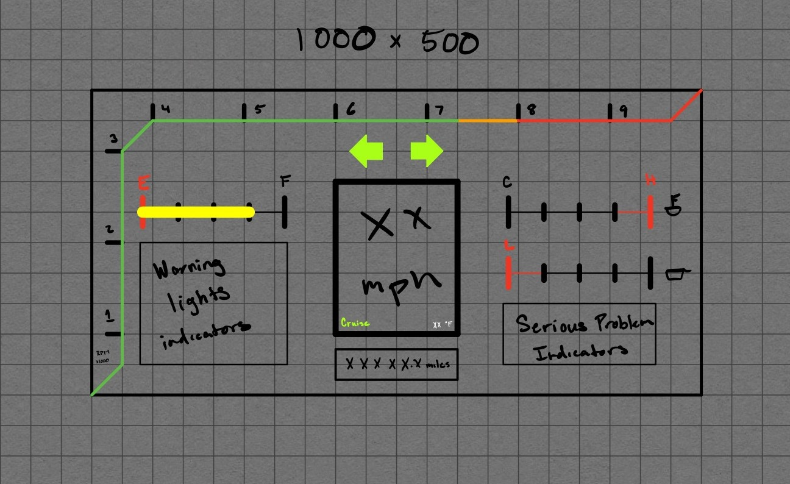
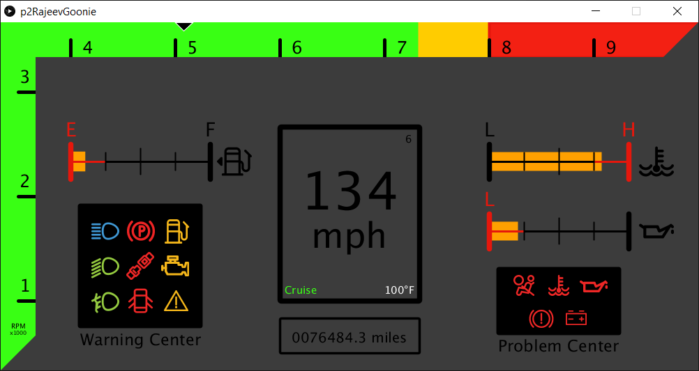

# HCI Project 2: The Car Dashboard
**Project Report Site:** https://rgoonie.github.io/p2RajeevGoonie/

---

## Project Synopsis

### Purpose
This project was designed to make us think about user interfaces that have had good and bad designs in the past. The dashboard of a car come in many configurations, formats, and designs. Some are great, while others are not. It all depends on the necessity of the user.

### Objective
My objective is to build a simplist car dashboard that can be used for both causal and sporty driver. My design will ideal place similar icons near each other,  redesign a tachometer that is not too overbearing yet still readable for those who use it, and have an overall simplistic looking design that anyone can use without trouble.

### Goals and Thoughts
* Minimize Tachometer
* Cluster similar icons
* Simplistic Design
* Maybe Video Game style?

### Low Fidelity Sketch

### Final Design Screenshot

### Build Information
This project was built using the Processing 3 framework for Java in the Processing IDE.

### YouTube Demo Presentation

