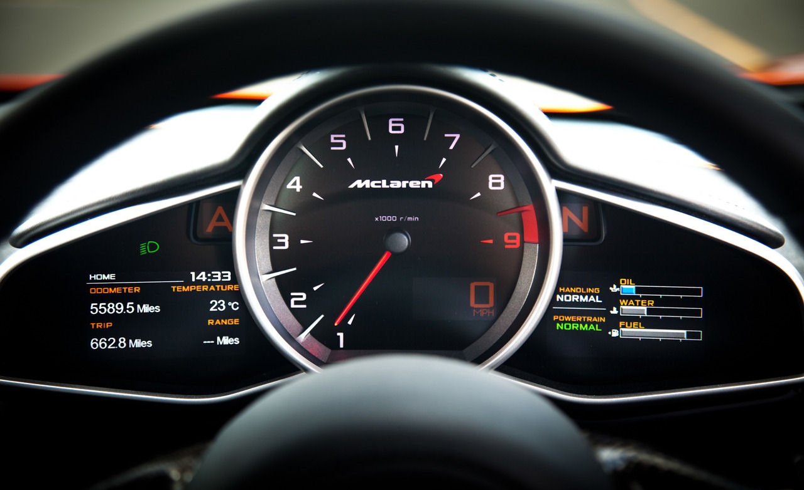
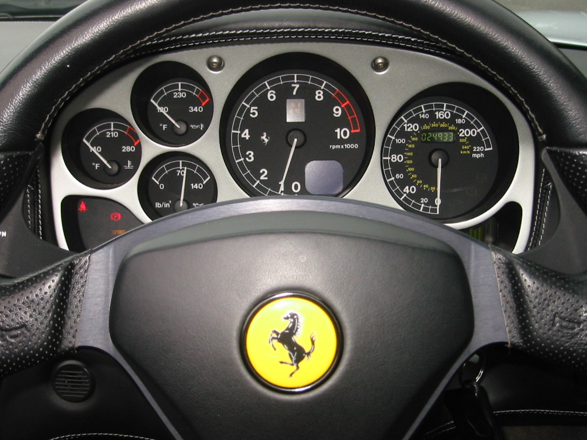
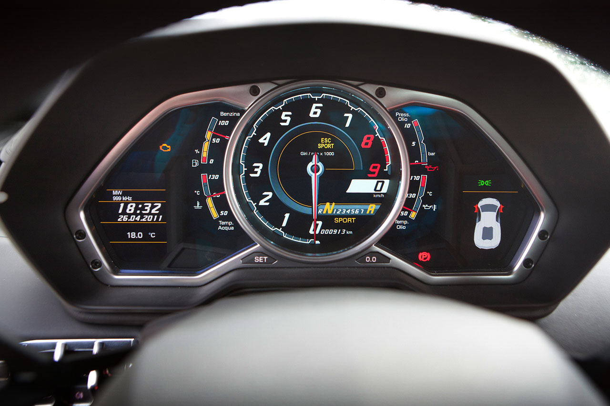
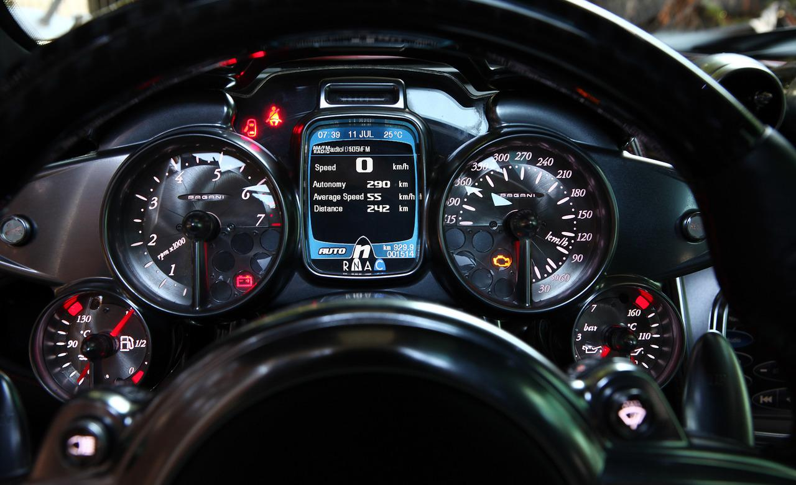

# Project 2: Car Dashboard
**Spring 2021 Human Computer Interaction Car Dashboard Project**

Completed by: Rajeev Goonie

---

## Existing Car Dashboards
Found at https://designsmaz.com/best-car-dashboard-designs/

### McLaren MP4-12C

|Pros|Cons|
|-|-|
|Minimalistic Design|Focus on Tachometer|
|Easy to Read Fuel/Engine Oil Gauge|Little Space for Warning Statuses|

**Explanation:** The design for the McLaren MP4-12C dashboard is good, in my opinion, due to its minimalistic design and easy to read gauges. The main issue with this is the focus on the tachometer, however, seeing as this is a more sporty/exotic car, it would make sense that a user would focus on the tachometer to ensure they do not overwork the engine when driving using a Tiptronic/Manual system.

### Bugatti Veyron

|Pros|Cons|
|-|-|
|Simple Color Scheme|Spread out gauges|
||Focus on Tachometer|
||Spread out Warning Statuses|
||Wasted Space|

**Explanation:** The design for the Bugatti Veyron dashboard is not too good, in my opinion, mainly due to the spread of each of the gauges and where the warning statuses may be. While everything is sectioned off, there is a ton of wasted space around the gauges where content could be put. This space could have been used to show warning statuses about the car instead of having them cramped in the negative space of the gauges. 

### Ferrari 360 Spider

|Pros|Cons|
|-|-|
|Easy to Read Gauges|Focus on Tachometer|
|One Location for Warning Statuses||
|Simplistic Design||

**Explanation:** The design for the Ferrari 360 Spider dashboard is good, in my opinion, due to its simplistic design. While it has a focus on its tachometer, all the gauges on this dashboard are easy to read. The design is good because there is one place to see all the warning statuses about the car.

### Lamborghini Aventador

|Pros|Cons|
|-|-|
|Bars for Gauges|Focus on Tachometer|
||Spread out Warning Statuses|
||Very Clustered/Distracting|

**Explanation:** The design for the Lamborghini Aventador is not good, in my opinion, due to its clustered design. Again, this design has its main focus on the tachometer which is ok due to the type of car this dash is for and its purpose, however, everything else seems to be clustered around this gauge. The clusteredness will make it hard to find what you need very easily. 

### Pagani Huayra

|Pros|Cons|
|-|-|
|Digital Display|Spread out Warning Statuses|
|Gauge Sizing||

**Explanation:** The design for the Pagani Huayra dashboard is good. The main feature that make this design nice is the digital display in the center of the screen that can help house information with ease. Other than that, the gauges are easy to read and have a nice size to them. The only issue is with the spread of the warning statuses that are spread out all over the display. 